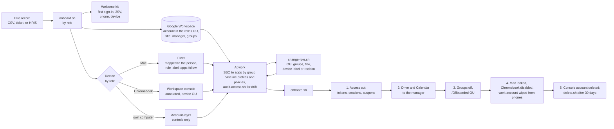

# Endpoint & Identity Lab

**A personal lab that reproduces the employee lifecycle on Google Workspace, Apple device
management (Jamf Now and self-hosted Fleet), and ChromeOS, on my own tenant and devices, built to
learn and practice the stack and documented as runbooks and decision notes.**

A person joins, works, changes role, and leaves. Each event is one command driven by a role
catalog: the account lands in the right organizational unit with the right groups and attributes,
the welcome kit is prepared, the company device the role entitles is assigned in its management
system, and on exit access is cut first, data moves to the manager, devices are locked or disabled,
and deletion waits for a retention period. The devices are a MacBook Pro and an iPad in Jamf Now,
two macOS virtual machines on the MacBook managed by Fleet with configuration shipped as code, and
a ChromeOS Flex virtual machine enrolled to the Workspace tenant. Every managed Mac other than the
MacBook is a VM, and the Chromebook is a VM, stated here so the scale is not misread.

**Start here if you have two minutes:** [one hire, start to finish](docs/demo.md), a single
fictional person taken through onboarding, a transfer, and offboarding, with the real output and
screenshots; then the [role catalog](lifecycle/README.md) and
[what changes at 500 users](docs/design.md#what-changes-at-500-users).

---

## The lifecycle



## The stack

| Layer | Tool | What it owns here | Configured in |
|---|---|---|---|
| Identity, directory, mail, Drive, SaaS access | Google Workspace Business Plus on a domain I own; GAM 7 from the admin workstation | accounts, OUs, groups, 2-Step Verification, session and password policy, OAuth app control, SAML SSO to the Fleet console, mobile management, the ChromeOS devices | [`workspace/tenant-settings.md`](workspace/tenant-settings.md), [`workspace/gam/`](workspace/gam/), [`lifecycle/`](lifecycle/) |
| Apple MDM, physical devices | Jamf Now | the MacBook (the admin workstation, on a light blueprint) and the iPad | [`mdm/blueprints.md`](mdm/blueprints.md) |
| Apple MDM as code, the Macs | Fleet, self-hosted in Docker Compose behind a Cloudflare Tunnel, configured with GitOps | two macOS VMs: configuration profiles, disk encryption, an OS floor, osquery policies with remediation, role software by label | [`fleet/gitops/`](fleet/gitops/), [`runbooks/fleet-setup.md`](runbooks/fleet-setup.md) |
| ChromeOS | ChromeOS Flex in a VM, ChromeOS Enterprise Upgrade | one enrolled device, policy from the Workspace console | [`chromeos/policies.md`](chromeos/policies.md), [`runbooks/chromeos-enrollment.md`](runbooks/chromeos-enrollment.md) |
| DNS and the tunnel | Cloudflare | the zone with DNSSEC, the tunnel that publishes Fleet | [`runbooks/fleet-setup.md`](runbooks/fleet-setup.md) |

One company device per person, chosen by the role, and nobody gets two:

| Device | Owned by | Managed by | How it enrolls |
|---|---|---|---|
| Mac | company | Fleet; Jamf Now for the admin workstation | user-approved MDM, baseline from GitOps |
| iPad | company | Jamf Now | Open Enrollment |
| Chromebook | company | Workspace, ChromeOS Enterprise Upgrade | enterprise enrollment at first sign-in |
| Phone, iOS or Android | personal | Workspace mobile management | add the work account; an admin approves the device |
| Contractor computer | personal or agency | not enrolled: account-layer controls only (OU session policy, the Chrome profile, Drive sharing) | sign in to Chrome with the work account |

## Roles

| Role | OU | Groups | Company device | Apps by role label |
|---|---|---|---|---|
| Engineer | `/Staff` | `all-staff`, `engineering` (also the SSO grant to the Fleet console) | Mac | Slack, VS Code |
| Marketing | `/Staff` | `all-staff`, `marketing` | Mac | Slack, Zoom |
| Sales | `/Staff` | `all-staff`, `sales` | Chromebook | |
| Contractor | `/Contractors` (twelve-hour sessions) | `contractors` | none, own computer | |

The catalog is one small file per role in [`lifecycle/roles/`](lifecycle/roles/); OUs carry
policy, groups carry access, the department attribute names the role. The reasoning is in
[`decisions/role-based-access.md`](decisions/role-based-access.md).

## Onboarding, in one screen

```bash
lifecycle/onboard.sh -p them@example.com -m aengineer -s 2026-10-06 -d Z597CMKJ30 marketing Jordan Mbeki
```

Creates the account in the role's OU (never in the root) with a random first password and the
role's title, department, and manager; adds the role's groups; renders the welcome kit (first
sign-in, the one-day 2-Step Verification window, the personal phone, the device); maps the Mac to
the person in Fleet and adds it to the role label, which makes Slack and Zoom arrive through
install policies, or annotates a Chromebook and moves it to the device OU. Then a read-back and
the checklist of what a human still does: send the kit, issue the password, hand over the device,
confirm the second factor after the first sign-in. A second run reports `ok` on every line. A CSV
of hires runs through `onboard-batch.sh`. Runbook: [onboarding](runbooks/onboarding.md).

## Offboarding, in one screen

```bash
lifecycle/offboard.sh -m aengineer praman        # or -e for the emergency form: access cut, stop
```

The order is the point. Access first: app passwords, backup codes, and tokens revoked, sessions
signed out, the account suspended, which ends SAML sign-in everywhere. Then Drive and the
calendars to the manager through the Data Transfer API, the mailbox retained in place and new mail
redirected to the manager in the console. Then every group
off and the account into `/Offboarded` with its deletion date in the note. Then the work account
wiped from personal devices, the Mac locked and returned to IT custody, the Chromebook disabled;
Jamf Now devices on the checklist, since it has no API. Then the console account that just-in-time
provisioning created, deleted. Deletion waits thirty days: `delete.sh` refuses until the earlier
steps are done and the date in the account note has arrived. Runbook: [offboarding](runbooks/offboarding.md).

## Role changes

`lifecycle/change-role.sh <user> <role>` converges the account to the new role: the OU if it
differs, the new role's groups added, other roles' groups removed, one-off grants kept and reported,
title and department updated, the Mac moved between role labels or reclaimed when the entitlement
changes class. `lifecycle/audit-access.sh` lists drift against the catalog at any time. Runbook:
[role change](runbooks/role-change.md).

An engineer's transfer to Marketing, from [the walkthrough](docs/demo.md): the groups swapped in
the directory, and Fleet installing the new role's app on her Mac minutes after the label moved.


## Where to look

| Path | What is there |
|---|---|
| [`runbooks/`](runbooks/) | one procedure each: the three lifecycle events, enrollment into each management system, the Fleet server, the lab VMs, SSO; each ends with the problems hit |
| [`lifecycle/`](lifecycle/) | the role catalog, the orchestrators, the welcome templates, the audit and the report |
| [`workspace/`](workspace/) | what is configured in the tenant and why; the GAM scripts the orchestrators call |
| [`mdm/`](mdm/) | the Jamf Now blueprints and a redacted profile |
| [`fleet/`](fleet/) | the Compose stack and everything Fleet applies, as YAML, profiles, policies, and scripts |
| [`chromeos/`](chromeos/) | the ChromeOS policies by device OU and by user OU |
| [`docs/demo.md`](docs/demo.md) | one hire from onboarding to offboarding, with the real output, the screenshots, and what went wrong on the day |
| [`docs/design.md`](docs/design.md) | the design, the decisions behind it, and what changes at 500 users |
| [`docs/kb/`](docs/kb/) | help articles for the person: first day, personal phone, company Mac, Chromebook, own computer, leaving |
| [`docs/evidence/`](docs/evidence/) | redacted screenshots and transcripts, each mapped to the statement it supports |
| [`decisions/`](decisions/) | short notes on the larger choices |
| [`scripts/`](scripts/) | the per-user Mac setup by role and the verify script that doubles as a compliance read from Fleet |

## What exists, and what is not built

| Outcome | Where | Evidence |
|---|---|---|
| Workspace tenant: OUs, groups, enforced 2-Step Verification, session and password policy, OAuth app control, mail authentication | `workspace/tenant-settings.md` | 02, 03, 04 |
| GAM lifecycle scripts run end to end; role-based onboarding, offboarding, and role change run against the tenant, Fleet, and the Chromebook for five fictional hires: accounts in the right OU with title, department, manager, and groups; the Macs mapped and labeled, the Chromebook annotated, the welcome kit rendered and sent. One hire taken from onboarding through a transfer to offboarding: single sign-on to the Fleet console allowed and then refused as her group changed, the new role's app delivered by label, her Mac locked and returned to IT custody, the console account deleted, deletion refused until the retention date, and her mail redirected in the console and tested. An engineer offboarded by the emergency form and then the full form; the Chromebook's holder offboarded with the device disabled and reclaimed; a role change round-tripped with the Mac's label moved by API; the access audit catching a group added by hand, the role change removing it, and the account-to-device report at the end state | `lifecycle/`, `workspace/gam/`, the three runbooks, [`docs/demo.md`](docs/demo.md) | 05, 14, 15, 16, 17, 18, 19, 20, 22, 23, 24 |
| The iPad and the MacBook enrolled in Jamf Now on two blueprints; a VM enrolled there and later migrated | `mdm/blueprints.md`, `runbooks/*-jamf.md` | 06, 07 |
| Two macOS VMs with distinct device identities | `runbooks/macos-vm-lab.md` | 08 |
| Fleet behind a tunnel with Apple MDM on; the baseline as code; a canary release; a Mac provisioned clean; a Mac migrated from Jamf Now with its recovery key escrowed; a broken policy repaired by its script; role software by label | `fleet/gitops/`, `runbooks/fleet-setup.md`, `mac-provisioning-fleet.md`, `mdm-migration-jamf-to-fleet.md` | 09, 10, 11, 12, 16 |
| SAML single sign-on from Workspace to the Fleet console, access by group, just-in-time provisioning | `runbooks/sso-app-setup.md` | 13 |
| A ChromeOS Flex device enrolled; device policy by its OU and user policy by the person's OU, verified on the device as a staff member and as a contractor; assigned through the lifecycle, disabled on exit with the return message on screen, re-enabled for the next person | `runbooks/chromeos-enrollment.md`, `chromeos/policies.md` | 16, 20 |
| The per-user Mac setup by role and its read-back, run on a managed Mac: six changes, then nothing to do, then every check passing | `scripts/` | 21 |
| Help articles for the person, runbooks for the administrator, a design note and decision notes | `docs/kb/`, `runbooks/`, `docs/design.md`, `decisions/` | |

State at this commit: one of the two virtual Macs is locked. The remote lock was tested on it on
2026-10-04, and a virtual Mac never draws the lock's PIN screen, so it stays locked until it is
rebuilt; the unlock by PIN is not shown anywhere here, and `lifecycle/offboard.sh` now refuses to
lock virtual hardware (Problems hit in [the offboarding runbook](runbooks/offboarding.md)).

Not built, on purpose, and named rather than implied: Automated Device Enrollment and Apple
Business Manager (no registered business, so enrollment is user-approved), Context-Aware Access
(not on this edition; the policy is described), domain-wide delegation (every write runs as the
administrator, so GAM cannot send mail and the welcome kit is hand-sent;
[the decision](decisions/no-domain-wide-delegation.md)), SCIM, Jamf Pro, Fleet
Premium beyond the trial, phones under management (no personal device is enrolled, so the
offboarding account wipe has never run against one; the iPad stays a company device in Jamf Now),
more than one physical Mac. Nothing here claims more than the tree contains at the commit you are
reading.

## Conventions

macOS scripts are zsh; GAM and lifecycle scripts are bash 3.2-compatible and shellcheck-clean;
the one Python script is standard library only and runs on the admin workstation. No secret is in
the tree: enroll secrets, tokens, keys, and the tunnel token come from files outside it, and GitOps
YAML uses variable substitution. Evidence is redacted by cropping; dates and elapsed offsets are
kept, clock times are removed. The lab was built with Claude Code as a pair; the evidence comes
from runs against the lab's own tenant, devices, and Fleet server.
