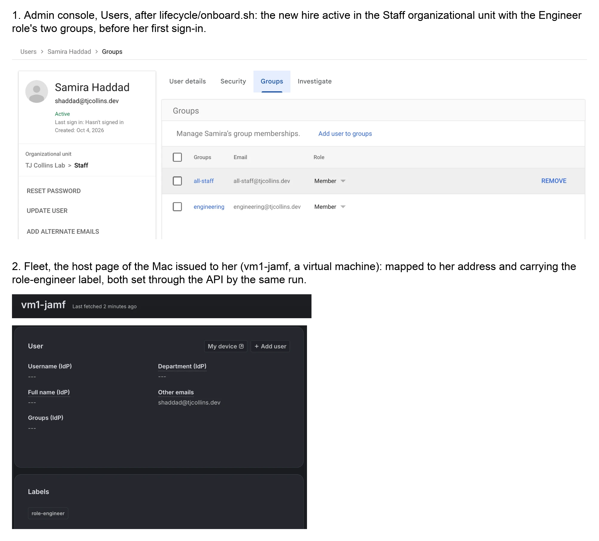
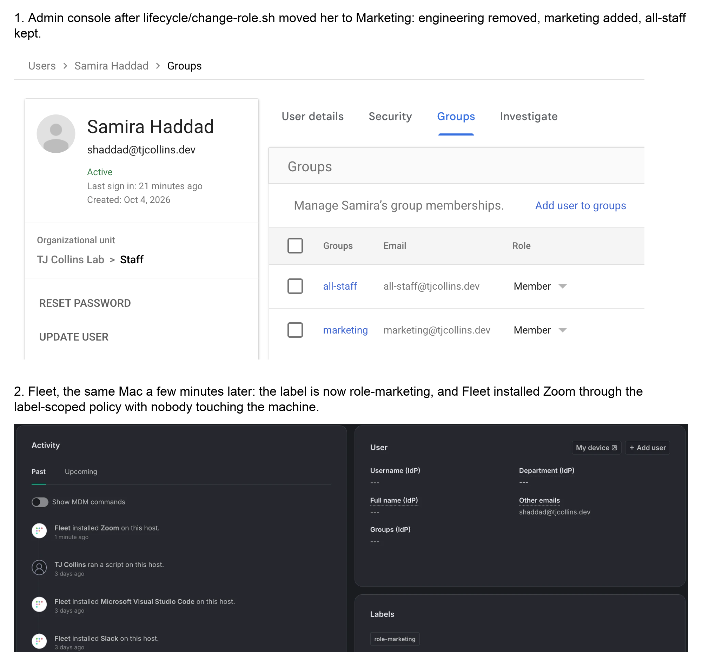
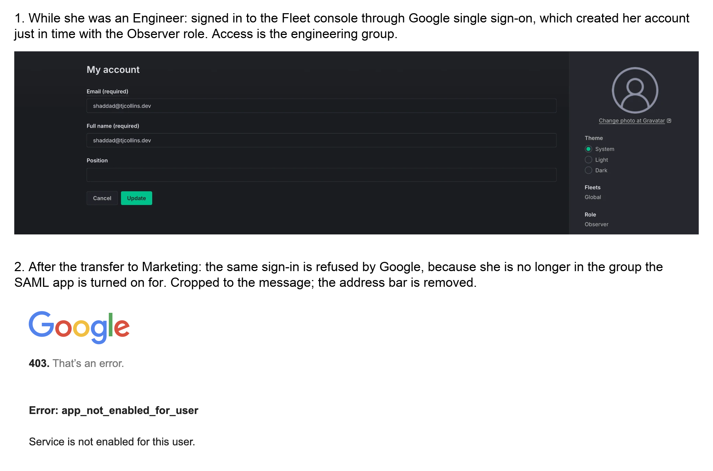
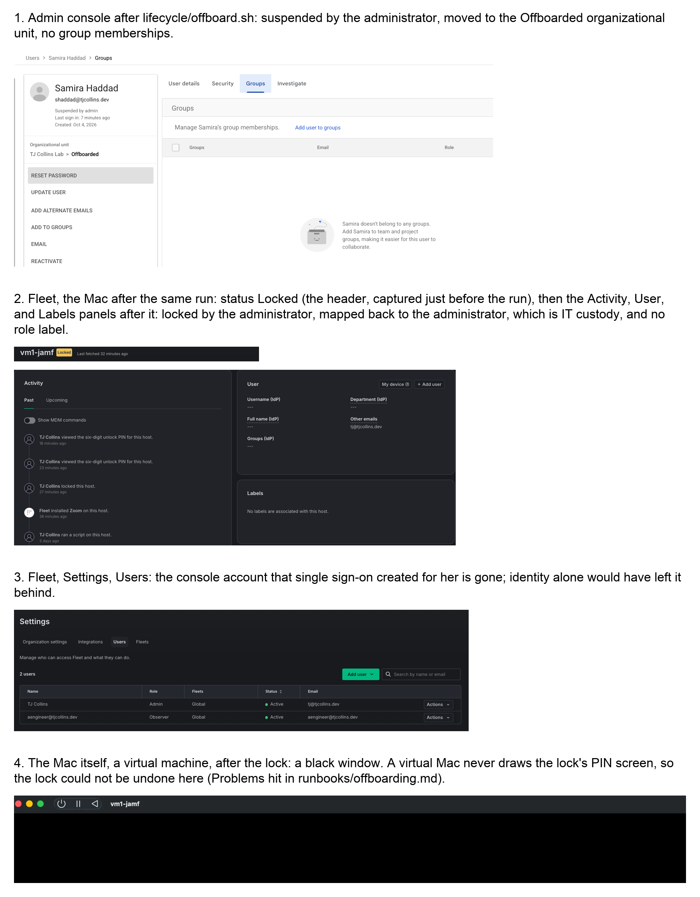

# One hire, start to finish

The lab in one page: a fictional person, Samira Haddad, joins as an Engineer with a company Mac,
transfers to Marketing, and leaves. The commands below were run on 2026-10-04 against the lab's
Google Workspace tenant and its Fleet server. The output is trimmed from the full transcript,
[`evidence/17-lifecycle-one-hire-arc.txt`](evidence/17-lifecycle-one-hire-arc.txt), which also
shows each command run a second time changing nothing.

What this is: three commands driven by a role catalog, with the account, its access, and the
device handled together and read back at the end. What it is not: a production service. The Mac is
a virtual machine, the trigger is a person at a terminal, and six things went wrong on the day,
listed [below](#what-went-wrong-on-the-day) because they are the useful part.

## The role is data

A role is one small file. This is the Engineer, [`lifecycle/roles/engineer.conf`](../lifecycle/roles/engineer.conf):

```
ROLE_OU=/Staff
ROLE_GROUPS=all-staff engineering
ROLE_TITLE=Software Engineer
ROLE_DEPARTMENT=Engineering
ROLE_DEVICE=mac
ROLE_FLEET_LABEL=role-engineer
```

The organizational unit carries policy, the groups carry access, the device line is the
entitlement, and the label decides which apps Fleet installs. Nothing below names a group or an
app on the command line.

## 1. She joins

```bash
lifecycle/onboard.sh -p tj@tjcollins.dev -m aengineer -s 2026-10-05 -d ZQGCYXVWFJ engineer Samira Haddad
```

`-p` is the personal address the password and the welcome kit go to; here it is a mailbox the lab
admin reads. `-d` is the serial of the Mac being issued.

```
t+0:00  == onboarding Samira Haddad as Engineer (OU /Staff, groups: all-staff engineering, device: mac), start 2026-10-05
t+0:06  changed: created shaddad@tjcollins.dev in /Staff
t+0:09  changed: title Software Engineer, department Engineering
t+0:11  changed: manager aengineer@tjcollins.dev
t+0:22  ok: groups: all-staff engineering
t+0:23  changed: welcome kit rendered to lifecycle/outbox/welcome-shaddad.txt (GAM sends mail only through domain-wide delegation, which this tenant does not grant)
t+0:24  changed: Fleet host vm1-jamf.local (ZQGCYXVWFJ) mapped to shaddad@tjcollins.dev
t+0:24  changed: vm1-jamf.local added to role-engineer
t+0:34  == 0 failed
```

The account is created in its destination OU, never in the root. The Mac is assigned by two API
calls, a person-to-device mapping and a label, with no configuration apply. The run ends with what
a person still does: issue the first password, send the welcome kit, hand over the Mac, and confirm
2-Step Verification after the first sign-in.



On the Mac, the per-user setup for her role and its read-back are two more scripts,
`scripts/mac-onboard.sh engineer` and `scripts/mac-verify.sh engineer`
([`evidence/21-mac-onboard-verify.txt`](evidence/21-mac-onboard-verify.txt): six changes, then
nothing to do, then 12 checks passed).

## 2. Access follows the group

She signs in for the first time, sets her own password, and opens the Fleet console with Google
single sign-on. The SAML app is turned on for the `engineering` group only, so the role is what
let her in, and Fleet created her account at that moment with the Observer role.

## 3. She transfers to Marketing

```bash
lifecycle/change-role.sh shaddad marketing
```

```
t+0:00  == role change for shaddad@tjcollins.dev: engineer (department Engineering) -> Marketing (OU /Staff, groups: all-staff marketing, device: mac)
t+0:04  ok: member of all-staff@tjcollins.dev (in the Marketing role)
t+0:05  changed: removed from engineering@tjcollins.dev
t+0:07  changed: added to marketing@tjcollins.dev
t+0:09  changed: title Marketing Manager, department Marketing
t+0:10  changed: vm1-jamf.local removed from role-engineer
t+0:11  changed: vm1-jamf.local added to role-marketing
t+0:25  == 0 failed
```

There is no stored "current role": the script converges the account to the catalog. Six minutes
later Fleet had installed Zoom on her Mac through the policy scoped to the new label.



The same sign-in to the Fleet console is now refused, by Google, because she left the group:



Her console account still exists at this point. Removing the group removed the way in, not the
account; that is the offboarding's job.

## 4. She leaves

```bash
lifecycle/offboard.sh -m aengineer shaddad
```

```
t+0:00  == offboarding shaddad@tjcollins.dev (marketing)
t+0:11  changed: access cut: shaddad@tjcollins.dev suspended
t+0:29  changed: Drive transferred to aengineer@tjcollins.dev
t+0:38  changed: Calendar transferred to aengineer@tjcollins.dev
t+0:41  changed: removed from all-staff@tjcollins.dev
t+0:42  changed: removed from marketing@tjcollins.dev
t+0:44  changed: moved to /Offboarded; delete on or after 2026-11-03
t+0:46  ok: vm1-jamf.local (ZQGCYXVWFJ) is locked
t+0:46  changed: vm1-jamf.local removed from role-marketing
t+0:47  changed: vm1-jamf.local mapped to tj@tjcollins.dev
t+0:48  changed: Fleet console account deleted
t+0:55  == 0 failed
```

The order is the point. Access goes first: tokens revoked, sessions signed out, the account
suspended, while every file stays where it is. Then the data moves to the manager, the groups come
off, and the account goes to the leavers' OU with its deletion date. Then the devices, and last the
application account that identity does not remove. One step stays in the console, because Gmail
routing has no API: her address is mapped to her manager's, since Google delivers nothing new to a
suspended mailbox. A test message sent to her afterwards was dropped for her and delivered to the
mapped mailbox, with no bounce to the sender
([`evidence/24-offboard-mail-address-map.png`](evidence/24-offboard-mail-address-map.png)).
Deletion waits:

```
$ workspace/gam/delete.sh shaddad
error: shaddad@tjcollins.dev is in its retention period; delete on or after 2026-11-03, or use -f
```



When access has to end before the paperwork, `lifecycle/offboard.sh -e <user>` does the first step
alone and stops; the full form finishes it later
([`evidence/17-lifecycle-offboard-emergency-then-full.txt`](evidence/17-lifecycle-offboard-emergency-then-full.txt),
an engineer who handed her Mac back in person, so it was not locked).

## Drift, found and fixed

Access also changes without a lifecycle event: someone adds a group by hand. After the runs above,
the Marketing hire who stayed was added to the `sales` group in the Admin console. The audit
compares every account with the catalog:

```
$ lifecycle/audit-access.sh
t+0:09    MISMATCH jmbeki@tjcollins.dev: in sales@tjcollins.dev, which belongs to another role, not Marketing
t+0:15  == 8 accounts, 1 mismatch(es), 1 item(s) to review
```

Running the role change to her own role removes that membership and nothing else, and the next
audit reports no mismatch ([`evidence/22-lifecycle-audit-access.txt`](evidence/22-lifecycle-audit-access.txt)).
A group that no role grants would have been kept and listed for review instead: one-off grants are
a person's decision, not the script's.

## Where everyone ended up

`lifecycle/lifecycle-report.py` joins the accounts to the devices they hold, from the directory and
the Fleet API ([`evidence/23-lifecycle-report.md`](evidence/23-lifecycle-report.md)):

| Account | Role | OU | State | Device | Management | Compliance |
|---|---|---|---|---|---|---|
| acontractor@tjcollins.dev | Contractor | /Contractors | active, 2SV off | none (own computer) | | |
| aengineer@tjcollins.dev | Engineer | /Staff | active, 2SV off | none | | |
| csalazar@tjcollins.dev | Sales | /Offboarded | suspended (ADMIN) | none | | |
| jmbeki@tjcollins.dev | Marketing | /Staff | active, 2SV off | Mac vm2-fleet.local (Z597CMKJ30) | Fleet, MDM On (manual), online, role-marketing, unlocked | 5/5 policies pass |
| mreyes@tjcollins.dev | Contractor | /Offboarded | suspended (ADMIN) | none (own computer) | | |
| praman@tjcollins.dev | Engineer | /Offboarded | suspended (ADMIN) | none | | |
| shaddad@tjcollins.dev | Marketing | /Offboarded | suspended (ADMIN) | none | | |
| tj@tjcollins.dev | none | / | active, 2SV on | Mac vm1-jamf.local (ZQGCYXVWFJ) | Fleet, MDM On (manual), offline, no role label, locked | 4/4 policies pass |
| tj@tjcollins.dev | none | / | active, 2SV on | Chromebook Flex-52:54:00:12:34:56 | Workspace, ACTIVE, OU /Devices | user policy follows the user's OU |

The two leavers of the day are suspended in `/Offboarded`; the Mac they each held is in IT custody,
mapped to the administrator, locked; the Chromebook is in IT custody from the earlier Sales
offboarding.

## What went wrong on the day

Running it on real systems found six things that reading the code had not. Each is written up
under Problems hit in the [offboarding](../runbooks/offboarding.md) and
[role-change](../runbooks/role-change.md) runbooks.

- **A read that lagged its write.** One second after suspending an account, the check printed
  `Account Suspended: False`. The account was suspended; the read was early. The check now retries.
- **A prompt that could not appear.** The script asks before locking a Mac, but the loop it asked
  from was reading its rows on standard input, so at a terminal it never asked. Fixed, then
  exercised with the lock command intercepted.
- **A retention period only a checklist enforced.** `delete.sh` would have deleted an account
  minutes after its offboarding. It now refuses until the date in the account's note.
- **A lock that is one-way on a virtual Mac.** The lock was acknowledged and the virtual machine
  never drew its PIN screen again, in normal or recovery start. No copy had been taken first, so
  that VM stays locked until it is rebuilt, and the script now refuses to lock virtual hardware.
  The unlock by PIN is therefore not shown anywhere in this repository.
- **A mail step that had never been run.** The runbook said a leaver's mailbox would keep a copy
  of new mail. Tested, Google drops mail to a suspended mailbox without a bounce; the step is now
  the recipient address map, with the result it actually gives.
- **A failed read taken for an answer.** The access audit turned one empty directory read into
  four findings on an account that was fine, and the same habit elsewhere would have reported "no
  Mac" with Fleet unreachable. Reads are now retried, and a lookup that still fails is reported
  as a failure.

## The other device paths, and the configuration

- **A Chromebook instead of a Mac** (the Sales role): assigned by annotation and device OU,
  disabled on exit with the return message on its screen, re-enabled for the next person:
  [`evidence/20-chromeos-offboard-run.txt`](evidence/20-chromeos-offboard-run.txt) and the images beside it.
- **Their own computer** (the Contractor role): nothing is enrolled; the controls are the OU's
  session length, the Chrome profile, and Drive sharing. See [`design.md`](design.md).
- **What the Mac carries** is in the repository and applied with `fleetctl gitops`: profiles, disk
  encryption, an OS floor, policies with remediation, and role software by label
  ([`../fleet/gitops/`](../fleet/gitops/), evidence 10 to 12).

## Showing it live

Everything read-only runs in a few minutes and changes nothing: `lifecycle/onboard.sh -n ...` for a
new name, `lifecycle/audit-access.sh`, `lifecycle/lifecycle-report.py`, and
`fleet/gitops/gitops.sh --dry-run`. A live onboarding and transfer use the second virtual Mac; the
first stays locked, as above.

## What changes at 500 users

The three that matter most, from [`design.md`](design.md#what-changes-at-500-users): the trigger
becomes the HRIS event or the ticket, with the run recorded on the ticket; SCIM creates and removes
application accounts, so the console-account step disappears; and Macs enroll themselves through
Automated Device Enrollment, with the person's account created at setup.
